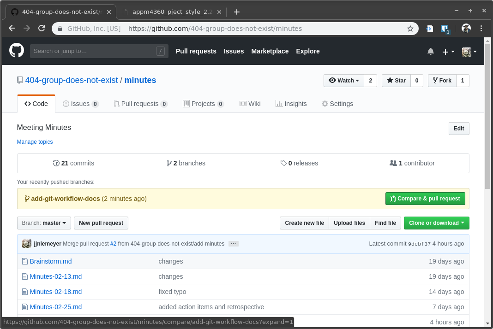
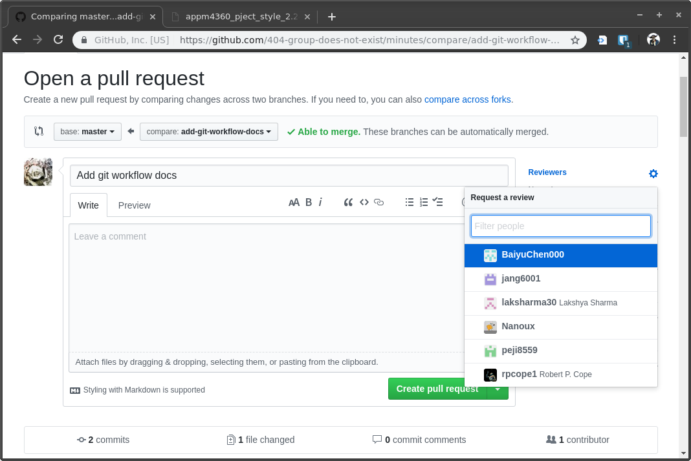

# Git Workflow by Example

## Setup

The first thing you'll want to do is navigate to the direcory where the repository is stored. In my case that would be:
```
    cd ~/Git/3308project/minutes 
```

Next, I want to make sure that I am on the master branch and I want to get the latest changes that exist on the master branch
```
    git checkout master
    git pull origin master
```

In addition to this you may want to make sure that all branches are available to you. `git remote update` will fetch any branches that have been added to the remote repo. 

At this point any changes that have occurred on the master branch since my lst pull has been updated on my local machine's master branch. 

## Doing Work

It is important not to work directly on the master branch. In this example walkthrough I am just updating the `/minutes` repository, there is no code here to break, so I will be branching off of `master` to make changes here and in the `/milestones` repo. In the actual `/Wifiology` repo the only difference is that we will make our personal branches off of the `dev` branch. (more on this later in the doc)

So after I've done the setup steps above, I'm now ready to do some actual work.
First, I create the branch that I will work on and give it a descriptive title using `git branch your-branch-name` . In this case, I'm adding this git workflow document so I type.
```
    git branch add-git-workflow-docs
```

Now if I type `git branch` again I see the following printed in the terminal:
```
       add-git-workflow-docs
    *  master

```

The asterisk indicates that I am still on the `master` branch, before I do any work I want to switch to the feature branch using `git checkout branch-name`.
so,
```
    git checkout add-git-workflow docs
```

Then if I type `git branch` again I'll see the asterisk has moved to the branch that I want to work on. At this point this entire directory on my machine reflects the branch that I just created. If I change anything in this directory It will need to be added, commited, *and* pushed before any changes are saved remotely.

So at this point with half the doc written, I'll save my work and push it to just this branch on the remote repository. Typing `git status` I see the following output:
```
On branch add-git-workflow-docs
Untracked files:
  (use "git add <file>..." to include in what will be committed)

	docs/

nothing added to commit but untracked files present (use "git add" to track)

```
with docs/ written in red because it is a folder full of changes that have not been added. `git add filename` adds the file named 'filename' but since I changed multiple files it is easier to do `git add . ` the '.' ensures that all untracked files are staged to commit. If I type `git status` again, I'll see my tracked changes in green, indicating they are ready to commit. use `git commit -m "message goes here"` to commit the change with a consise description of what has changed.

```
    git commit -m "created docs folder and workflow.md"
```

This produces the following output:
```
   [add-git-workflow-docs f08a7fb] created docs folder and workflow.md
   1 file changed, 49 insertions(+)
   create mode 100644 docs/workflow.md
```
The branch is now up to date on my local machine but it is not stored anywhere else.

Finally, I push the changes to have them saved online in the repo
```
    git push origin add-git-workflow.md
```

I'm prompted for my github username and passoword and see the following output:
```
Counting objects: 4, done.
Delta compression using up to 8 threads.
Compressing objects: 100% (3/3), done.
Writing objects: 100% (4/4), 1.30 KiB | 0 bytes/s, done.
Total 4 (delta 1), reused 0 (delta 0)
remote: Resolving deltas: 100% (1/1), completed with 1 local object.
remote: 
remote: Create a pull request for 'add-git-workflow-docs' on GitHub by visiting:
remote:      https://github.com/404-group-does-not-exist/minutes/pull/new/add-git-workflow-docs
remote: 
```

Now I can see the branch available on the github website.

Repeat this process as needed while working on the branch. Even though the branch should be dedicated to only one feature at a time, I still may need to work on it incrementally and its always a good idea to save and backup your work. Any time you reach a stopping point, its a good habit to `add`, `commit` and `push` changes to the branch you are working.

## Pull Requests and Merge

When the feature on which you are working is finally complete, you want to merge that branch (onto the `dev` branch in the case of `Wifiology` repo) in this case, onto `master`. This is done most easily from the github website.



At the top we see the recently pushed branches. click the green 'compare & pull request' button. Here is the pull reques screen, at the right click on 'reviewers' and add all of the team to review. Please to not add the the TA Lakshya to the review, he only needs access to the repo for grading.

Finally, after adding reviewers click the 'create pull request' button. Once someone else reviews it we can merge it onto the master branch.



## Working on the actual code Repository

TODO
The main difference is branching off of `dev` instead of `master`...I'll expound on it after everyone gets this first step down.


